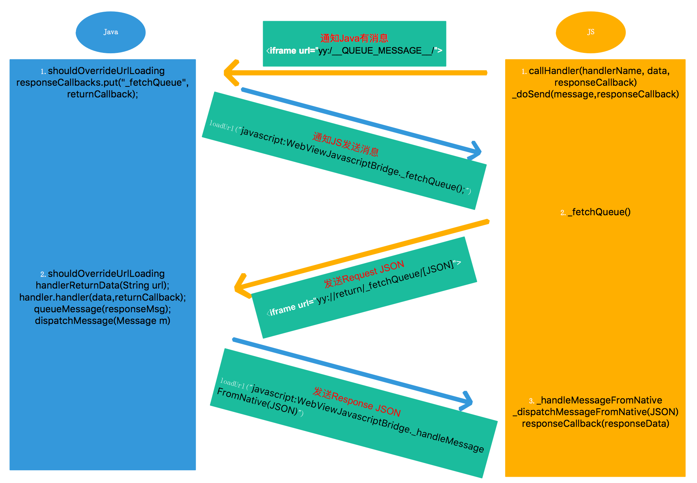
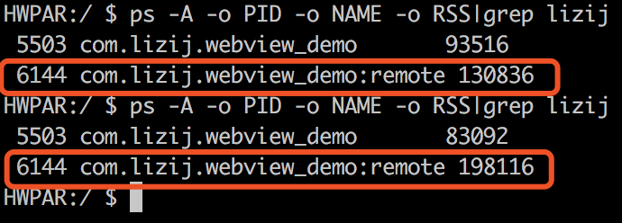
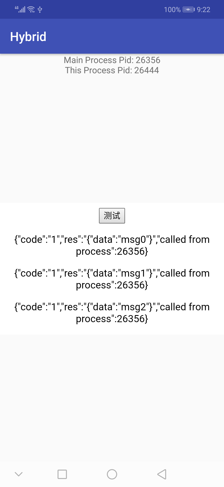

# JsBridge

[TOC]

[Demo Code](https://github.com/lizij/JsBridgeDemo.git)

# 使用场景

* Native无法线上修改，H5可以线上修改
* H5需要和Native交互

# 原理

## Js调用Java

### `WebView.addJavascriptInterface()`

* 实现方案最简单，直接向网页中注入Java对象，Js可以直接引用该对象并执行方法
* 安全性有问题
  * API 16（4.1.2）以下，WebView使用WebKit浏览器引擎，并未正确限制`addJavascriptInterface`的使用方法，在应用权限范围内，攻击者可以通过Java反射机制实现任意命令执行
  * API 17（4.2）以上，WebView使用Chromium浏览器引擎，并且限制了Javascript对Java对象方法的调用权限，只有声明了@JavascriptInterace注解的方法才能被Web页面调用，但仍然可能被不可信的Js调用

```java
WebView webView = new WebView (R.id.webView);
webView.getSettings().setJavaScriptEnabled(true);
webview.addJavascriptInterface(new FileUtils(), "FUtil");
webView.loadUrl("http://test.com");

class FileUtils {
    @JavascriptInterace
    public void write(String filename, String data) {}
}
```

```javascript
filename = '/mnt/sdcard/test.txt';
FUtil.write(filename, data);
```

### `WebViewClient.shouldOverrideUrlLoading()`

```java
/**
 * Give the host application a chance to take over the control when a new
 * url is about to be loaded in the current WebView. If WebViewClient is not
 * provided, by default WebView will ask Activity Manager to choose the
 * proper handler for the url. If WebViewClient is provided, return true
 * means the host application handles the url, while return false means the
 * current WebView handles the url.
 * This method is not called for requests using the POST "method".
 *
 * @param view The WebView that is initiating the callback.
 * @param url The url to be loaded.
 * @return True if the host application wants to leave the current WebView
 *         and handle the url itself, otherwise return false.
 * @deprecated Use {@link #shouldOverrideUrlLoading(WebView, WebResourceRequest)
 *             shouldOverrideUrlLoading(WebView, WebResourceRequest)} instead.
 */
@Deprecated
public boolean shouldOverrideUrlLoading(WebView view, String url) {
    return false;
}
```

* 如果未提供自定义WebViewClient，通过Activity Manager寻找合适的处理器
* 如果提供了自定义WebViewClient
  * return true，宿主应用自己处理url => 对应JsBridge使用场景
  * return false，当前WebView自己处理url
* 只能处理根Web页的ur跳转，无法处理内部iframe或ajax的跳转

> 该方式无法作用于ajax等内部访问，如果需要处理内部访问，最好覆写`WebViewClient.shouldInterceptRequest`，但该方法会拦截所有请求，包括js文件和图片资源等，会增加开销

```java
@Override
public boolean shouldOverrideUrlLoading(WebView view, String url) {
    return mJsBridge != null && mJsBridge.tryInvokeJavaMethod(url);
}
```

### `WebChromeClient.onJsAlert()/onJsConfirm()/onJsPrompt()`

这三个Js给Native代码的回调接口的作用分别是展示警告信息，展示确认信息和展示提示信息，一般`prompt()`使用较多

```js
window.prompt(message, defaultValue)
```

```java
public class CustomWebChromeClient extends WebChromeClient {

    @Override
    public boolean onJsPrompt(WebView view, String url, String message, String defaultValue, JsPromptResult result) {
        // 处理JS 的调用逻辑
        result.confirm();
        return true;
    }
}
```

### `WebChromeClient.onConsoleMessage()`

这是Android提供给Js调试在Native代码里面打印日志信息的API，同时这也成了其中一种Js与Native代码通信的方法

```javascript
console.log('log message that is going to native code');
```

```java
public class CustomWebChromeClient extends WebChromeClient {
    @Override
    public boolean onConsoleMessage(ConsoleMessage consoleMessage) {
        super.onConsoleMessage(consoleMessage);
        String msg = consoleMessage.message();//JavaScript输入的Log内容
    }
}
```

> 个人认为这2种方式原理上可以实现，但最好封装一下，不然可能会在代码中埋坑，看起来只是打了log或者发送了提示信息

## Java调用Js

* 加载调用`javascript:func(params)`
  * `WebView.loadUrl()`：保底方式
  * `WebView.evaluateJavascript()`：API 19以上可以使用

# 简单Demo

## Js部分

Js部分主要是通过一个不可见的iframe来加载JsBridge的相关的url，例如"jsbridge:[Base64.encode(json)]"

jsbridge的部分

```javascript
var jsFrame;

    $(function () {
        jsFrame = $('<iframe id="jsbridge"></iframe>')[0];
        jsFrame.style.display = 'none';
        $('body').append(jsFrame);
    });

    /**
     * @param {string} func - Native方法名
     * @param {dict} params - 参数
     * @param {string} callbackFunc - 回调函数，结构必须为function(string)
     */
    function callNativeMethod(func, params, callbackFunc) {
        data = {
            func: func,
            params: params,
            callback_func: callbackFunc
        };

        var url = 'jsbridge:' + btoa(JSON.stringify(data));
        console.log(url);
        jsFrame.src = url;
    }
```

测试部分

```javascript
var msgCount = 0;

function test() {
    callNativeMethod('testJsBridge', { data: "msg" + (msgCount++) }, 'callback');
}

function callback(msg) {
    $("#test").append('<p>' + msg + '</p>');
}
```

## Java部分

## 预注册WebView和JsBridge

```java
// MyWebActivity.java
webView = findViewById(R.id.webView);

if (webView != null) {
    MyJsBridge jsBridge = new MyJsBridge(webView);
    jsBridge.registerJavaMethod("testJsBridge", new TestJsBridge());

    MyWebViewClient myWebViewClient = new MyWebViewClient(jsBridge);

    webView.setWebViewClient(myWebViewClient);
    webView.setWebChromeClient(new WebChromeClient());
    WebSettings webSettings = webView.getSettings();
    webSettings.setJavaScriptEnabled(true);
    webView.loadUrl("http://mytest.com");
}

// TestJsBridge.java
public class TestJsBridge implements IJavaMethod {
    @Override
    public void call(String func, String param, JSONObject res) throws Exception {
        res.put("res", param);
    }
}
```

### 拦截Url

```java
public class MyWebViewClient extends WebViewClient {

    private MyJsBridge mJsBridge;

    /**
     * intercept url and try invoke pre-registered java methods
     * @param view
     * @param request
     * @return
     */
    @Override
    public boolean shouldOverrideUrlLoading(WebView view, WebResourceRequest request) {
        return mJsBridge != null && mJsBridge.tryInvokeJavaMethod(request.getUrl());
    }
}
```

### 尝试调用Java方法

```java
public class MyJsBridge {

    private String mSchema = DEFAULT_SCHEMA;

    private Map<String, IJavaMethod> mRegisteredMethods = new HashMap<>();

    private WebView mWebView;
    
    private Handler mMainHandler = new Handler(Looper.getMainLooper());

    /**
     * register java method with {@link IJavaMethod} instance and its name
     * @param func function name
     * @param method {@link IJavaMethod} instance
     */
    public void registerJavaMethod(String func, IJavaMethod method) {
        if (!TextUtils.isEmpty(func) && method != null) {
            mRegisteredMethods.put(func, method);
        }
    }

    /**
     * try compare the schema of uri with {@link MyJsBridge#mSchema}
     * @param uri
     * @return true if the schemas are equal
     */
    public boolean tryInvokeJavaMethod(final Uri uri) {
        if (uri != null && TextUtils.equals(uri.getScheme(), mSchema)) {
            mMainHandler.post(new Runnable() {
                @Override
                public void run() {
                    invokeJavaMethod(uri.getSchemeSpecificPart());
                }
            });
            return true;
        }
        return false;
    }

    /**
     * extract func, params and callback_func from uri and invoke the pre-registered java method
     * then invoke callback_func of js.
     * @param data
     */
    private void invokeJavaMethod(String data) {
            JSONObject jo = new JSONObject(msg);
            String func = jo.optString("func");
            String params = jo.optString("params");
            String callbackFunc = jo.optString("callback_func");

            JSONObject res = new JSONObject();
            res.put(RESULT_CODE, RESULT_FAILED);

            if (mRegisteredMethods.containsKey(func)) {
                try {
                    mRegisteredMethods.get(func).call(func, params, res);
                    res.put(RESULT_CODE, RESULT_SUCCESS);
                } catch (Exception e) {
                    e.printStackTrace();
                }
            }

            sendJsMessage(callbackFunc, res);
        } catch (Exception e) {
            e.printStackTrace();
        }
    }

    /**
     * invoke js function jsFunc by {@link WebView#evaluateJavascript(String, ValueCallback)} or {@link WebView#loadUrl(String)}
     * @param jsFunc
     * @param msg
     */
    private void sendJsMessage(String jsFunc, JSONObject msg) {
        if (mWebView == null) {
            return;
        }

        String url = String.format("javascript:%s('%s')", jsFunc, msg.toString());
        CallJsUtil.loadUrl(mWebView, url);
    }
}
```

# [lzyzsd/JsBridge](https://github.com/lzyzsd/JsBridge)原理

这是github上一个非常流行的JsBridge仓库，引入了消息队列，可以参考实现一个更规范的JsBridge框架



# 独立进程WebView下的JsBridge设计探索

## 独立进程WebView

### 介绍

目前有很多App采用了独立进程WebView，原因一般是以下两点

* 大量Web页面的使用容易导致OOM
* Android版本不同，采用了不同的内核，或网页版本不同，都可能导致兼容性Crash

这样即使WebView所在进程崩溃，也不会影响主进程

> 以微信为例，`com.tencent.mm:toolsmp`应该就是webview所在进程，RSS表示的是物理内存占用，单位为KB
>
> 在打开链接[冬令营 I 校园项目组带你逛 GDD，解锁谷歌 AI 机器学习应用冬令营！](https://mp.weixin.qq.com/s/RC80XI2CgNTuyPzCywr0KA)后，可以看到该进程的内存占用有明显变化，大约增加了38MB
>
> 

### 原生WebView独立进程搭建

大部分情况下，原生WebView只要基于一个声明为与主进程不同的Activity即可搭建

创建MyWebActivity，在Manifest中声明如下

```xml
<activity
          android:name="com.lizij.activity.MyWebActivity"
          android:process=":remote">
</activity>
```

> 也可以声明 intent-filter 部分通过Uri传值，action用于指定需要调起的Activity，scheme用于拼接Uri传值
>
> ```xml
> <intent-filter>
>     <action android:name="myweb.action"/>
>     <category android:name="android.intent.category.DEFAULT"/>
>     <data android:scheme="web"/>
> </intent-filter>
> ```

效果如下，同样是打开[冬令营 I 校园项目组带你逛 GDD，解锁谷歌 AI 机器学习应用冬令营！](https://mp.weixin.qq.com/s/RC80XI2CgNTuyPzCywr0KA)，独立进程的原生WebView内存占用增加了大约65MB（同样的，如果在主进程打开也会导致主进程内存占用增加大约65MB），进程本身占用内存大约127MB，相比微信的方案可以说非常不合算



## 设计思路

以下是基于简单Demo的JsBridge设计，核心思路是分离简单Demo中JsBridge的功能，主要包括3部分：

1. 在remote进程中检查schema和回调js
2. 在主进程中触发Java方法
3. 两个进程间的AIDL通信

## BinderPool设计

首先需要设计的是基本的Binder池部分，保证进程间的通信，这样才能继续后面的工作，同时也方便扩展

### Binder查询模块

IBinderManager.aidl

```java
interface IBinderManager {
    IBinder queryBinder(int binderCode);
}
```

BinderManager.java

```java
/**
 * query binder service by binderCode
 * @author lizijian
 */
public class BinderManager extends IBinderManager.Stub {

    public static final int BINDER_JSBRIDGE_CODE = 0x101;

    @Override
    public IBinder queryBinder(int binderCode) {
        IBinder binder = null;
        switch (binderCode) {
            case BINDER_JSBRIDGE_CODE:
                binder = new JsBridgeBinder();
                break;
            default:
                break;
        }

        return binder;
    }
}
```

### Service设计

```java
public class BinderPoolService extends Service {
    private BinderManager binder;

    @Override
    public void onCreate() {
        super.onCreate();
        binder = new BinderManager();
    }

    @Nullable
    @Override
    public IBinder onBind(Intent intent) {
        return binder;
    }
}
```

### BinderPool设计

```java
public class BinderPool {
    // double check singleton

    private CountDownLatch countDownLatch;

    private IBinderManager binderManager;

    /**
     * bind {@link BinderService} and get {@link BinderManager} binder instance
     * @param context
     */
    @WorkerThread
    public synchronized void bind(final Context context) {
        // should be call in WorkThread
        if (context == null) {
            return;
        }
        
        countDownLatch = new CountDownLatch(1);
        Intent intent = new Intent(context, BinderService.class);

        context.bindService(intent, new ServiceConnection() {
            @Override
            public void onServiceConnected(ComponentName name, IBinder service) {
                // called in MainThread
                binderManager = IBinderManager.Stub.asInterface(service);
                try {
                    // when binder die, rebind binderManager with context
                    binderManager.asBinder().linkToDeath(new IBinder.DeathRecipient() {
                        @Override
                        public void binderDied() {
                            binderManager.asBinder().unlinkToDeath(this, 0);
                            binderManager = null;
                            bind(context);
                        }
                    }, 0);
                } catch (RemoteException e) {
                    e.printStackTrace();
                }

                countDownLatch.countDown();
            }

            @Override
            public void onServiceDisconnected(ComponentName name) {

            }
        }, Context.BIND_AUTO_CREATE);
        try {
            countDownLatch.await();
        } catch (InterruptedException e) {
            e.printStackTrace();
        }
    }
    
    public IBinder getJsBridgeBinder() {
        IBinder binder = null;
        try {
            if (binderManager != null) {
                binder = binderManager.queryBinder(BinderManager.BINDER_JSBRIDGE_CODE);
            }
        } catch (RemoteException e) {
            e.printStackTrace();
        }

        return binder;
    }
}
```

## 主进程执行部分

### JsBridge Binder

IJsBridgeBinder调用，其中params和return结果都默认是json字符串

```java
interface IJsBridgeBinder {
    String invokeJavaMethod(in String methodName, in String params);
}
```

IJsBridgeBinder实现，返回预注册Java方法执行结果的json字符串

```java
/**
 * For remote web process call java method in main process
 * @author lizijian
 */
public class JsBridgeBinder extends IJsBridgeBinder.Stub {

    private Map<String, IJavaMethod> mRegisteredMethods = new HashMap<>();

    public JsBridgeBinder() {
        // register jsbridge function for remote process usage
        registerJavaMethod("testJsBridge", new TestJsBridge());
    }

    /**
     * Call java method registered in main process
     * @param func method name
     * @param params json string
     * @return result json string
     */
    @Override
    public String invokeJavaMethod(String func, String params) {
        try {
            JSONObject res = new JSONObject();
            res.put(RESULT_CODE, RESULT_FAILED);
            if (mRegisteredMethods.containsKey(func)) {
                mRegisteredMethods.get(func).call(func, params, res);
                res.put(RESULT_CODE, RESULT_SUCCESS);
            }
            return res.toString();
        } catch (Exception e) {
            e.printStackTrace();
        }
        return null;
    }

    public void registerJavaMethod(String func, IJavaMethod method) {
        if (!TextUtils.isEmpty(func) && method != null) {
            mRegisteredMethods.put(func, method);
        }
    }
}
```

## Remote进程部分

### WebViewClient

主要是使用webBinder，切换到主进程获取执行结果，然后回到原进程调用js返回执行结果

```java
public class MyRemoteWebViewClient extends WebViewClient {

    private IWebBinder webBinder;
    private String mSchema = DEFAULT_SCHEMA;
    private Handler mMainHandler = new Handler(Looper.getMainLooper());

    public MyRemoteWebViewClient(IWebBinder webBinder) {
        this.webBinder = webBinder;
    }

    @Override
    public boolean shouldOverrideUrlLoading(WebView view, WebResourceRequest request) {
        return tryInvokeJavaMethod(request.getUrl(), view);
    }

    public boolean tryInvokeJavaMethod(final Uri uri, final WebView view) {
        if (uri != null && TextUtils.equals(uri.getScheme(), mSchema)) {
            mMainHandler.post(new Runnable() {
                @Override
                public void run() {
                    invokeJavaMethod(uri.getSchemeSpecificPart(), view);
                }
            });
            return true;
        }
        return false;
    }

    private void invokeJavaMethod(String data, final WebView webView) {
        try {
            String msg = new String(Base64.decode(data, Base64.DEFAULT));
            JSONObject jo = new JSONObject(msg);
            String func = jo.optString("func");
            String params = jo.optString("params");
            final String callbackFunc = jo.optString("callback_func");

            String res = webBinder.invokeJavaMethod(func, params);
            String url = String.format("javascript:%s('%s')", callbackFunc, res);
            CallJsUtil.loadUrl(webView, url);
        } catch (Exception e) {
            e.printStackTrace();
        }
    }

```

### 绑定JsBridge Binder服务并初始化WebView

```java
private void initWebViewWithRemoteJsBridge() {
        if (webView == null) {
            return;
        }

        Task.callInBackground(new Callable<Void>() {
            @Override
            public Void call() throws Exception {
                // get BinderPool
                BinderPool binderPool = BinderPool.inst();

                // bind this activity with BinderService in main process
                binderPool.bind(WebActivity.this);
                
                // get binder from binderPool
                IBinder binder = binderPool.getWebBinder();
                final IWebBinder webBinder = IWebBinder.Stub.asInterface(binder);
                
                
                runOnUiThread(new Runnable() {
                    @Override
                    public void run() {
                        // init webview
                        MyRemoteWebViewClient myWebViewClient = new MyRemoteWebViewClient(webBinder);

                        webView.setWebViewClient(myWebViewClient);
                        webView.setWebChromeClient(new WebChromeClient());
                        WebSettings webSettings = webView.getSettings();
                        webSettings.setJavaScriptEnabled(true);
                        
                        // load 
                        webView.loadUrl("http://mytest.com");
                    }
                });
                return null;
            }
        });
    }
```

## 结果示例



# 参考

[Android与JS之JsBridge使用与源码分析](https://www.jianshu.com/p/e4f7fb571cc0)

[WebView 安全之 addJavascriptInterface](https://www.jianshu.com/p/6309d243e4c0)

[在WebView自身打开链接 -- 关于WebViewClient类shouldOverrideUrlLoading的错误用法](https://blog.csdn.net/zhyh1986/article/details/42169159)

[JsBridge 实现 JavaScript 和 Java 的互相调用](https://juejin.im/entry/573534f82e958a0069b27646)

[Android WebView 全面干货指南](https://juejin.im/entry/5a3326def265da4310486abe)

[Android WebView独立进程解决方案](https://www.jianshu.com/p/b66c225c19e2)

[Hybrid APP基础篇(一)->什么是Hybrid App](https://www.cnblogs.com/dailc/p/5930231.html)